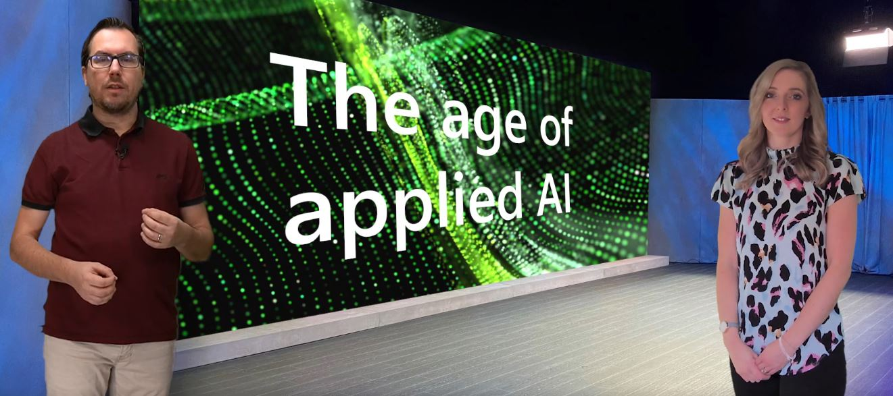
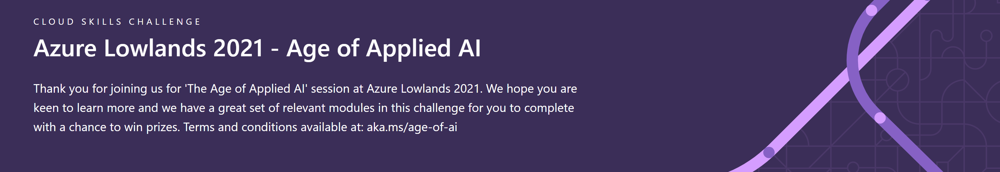
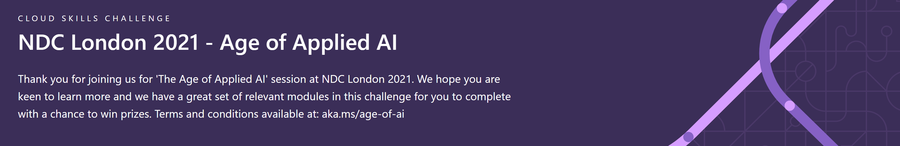

# The Age of Applied AI

- [Cloud Skills Challenges](#cloud-skills-challenge)
- [Presentation resources](#chapter-related-resources)
- [More AI learning resources](#more-ai-learning-resources)

After a tremendous age of innovation and research in the AI field, we are moving towards the age of appliance. But how and where do you get started as a developer and how do you apply machine learning ethically and use it for good.

In this talk we dive into the current state of everyday AI, debate the challenges that come with responsible AI and you will get some tips and tricks how you can advantage of AI as a developer.

By [Amy Boyd](https://twitter.com/AmyKateNicho) and [Henk Boelman](https://twitter.com/hboelman)

--------------

# Cloud Skills Challenge

## Azure Lowlands 2021

### **Challenge Page:** [Azure Lowlands 2021 - Age of Applied AI](https://docs.microsoft.com/learn/challenges?id=75e4bb5e-075d-4d9c-8235-d259d567f83d&ocid=aid3028059&WT.mc_id=aiml-13838-CXA)

**Terms and Conditions:**
We have 3 swag bag prizes available for you to win by reaching the top of the leaderboard. 

This challenge will run from 29th January 2021 - 3rd February 2021. On 4th February 2021 we will post the aliases of the 3 winning entries on this page and ask for you to reach out to us - so keep an eye on the link above.

## NDC London 2021

### **Challenge Page:** [NDC London 2021 - Age of Applied AI](https://cloudskillschallenge.docs.microsoft.com/CSC/Challenge?challenge=f650a290-4fcf-4b55-9b0e-c8ee224252ba&WT.mc_id=aiml-13838-CXA)

**Terms and Conditions:**
We have 20 Microsoft Certification Discount Codes as prizes available for you to win by reaching the top of the leaderboard. 

This challenge will run from 29th January 2021 - 3rd February 2021. On 4th February 2021 we will post the aliases of the 20 winning entries on this page and ask for you to reach out to us - so keep an eye on the link above.

--------------

# Chapter Related Resources

## Chapter 1 - The history of AI

The more you search the more you learn - but a good few starting points are shared below. Happy searching ...

* [History of Artificial Intelligence](https://en.wikipedia.org/wiki/History_of_artificial_intelligence)
* [The Evolution of AI - RunAsRadio](http://runasradio.com/Shows/Show/739)

## Chapter 2 - What is AI?

* [Fundamentals of machine learning in the cloud](https://azure.microsoft.com/resources/videos/fundamentals-of-machine-learning-in-the-cloud/?WT.mc_id=aiml-13838-CXA)
* [What is Machine Learning](https://azure.microsoft.com/overview/what-is-machine-learning-platform/?WT.mc_id=aiml-13838-CXA)
* [Introduction to Azure AI](https://azure.microsoft.com/resources/videos/intro-to-azure-ai/?WT.mc_id=aiml-13838-CXA)
* See more videos like this [here](https://azure.microsoft.com/resources/videos/index/?WT.mc_id=aiml-13838-CXA)

## Chapter 3 - What is possible?
- [Demo video](https://www.youtube.com/watch?v=8KuJKlDSNwA)
- [Blog post]()

## Chapter 4 - Responsible AI

In this chapter we spoke about "Would we Trust and AI to ..." and a FATE Framework we can use as a tool to help build ethical AI Projects. To read more check out the resources below:

- [Blog Post: Would you trust an AI to …? A list of questions to help you figure out the answer](https://aka.ms/ethical-ai-questions)
- [Microsoft Research FATE: Fairness, Accountability, Transparency and Ethics in AI](https://www.microsoft.com/research/theme/fate/?WT.mc_id=aiml-13838-CXA)

## Chapter 5 - Build vs Buy

In this chapter we showed 2 demos that solved the problem of analyzing invoices, extratcing values and then using them in an application:
* **Demo 1:** Azure Forms Recognizer and Azure Functions
    * [Demo Video](https://youtu.be/nmqt3oDOflY)
    * [Azure Forms Recognizer Documentation](https://docs.microsoft.com/azure/cognitive-services/form-recognizer/?WT.mc_id=aiml-13838-CXA)
    * [Azure Functions Documentation](https://docs.microsoft.com/azure/azure-functions/?WT.mc_id=aiml-13838-CXA)
* **Demo 2:** Microsoft Power Platform AI Builder and PowerApps
    * [Demo Video](https://youtu.be/_FFMTmPDNls)
    * [AI Builder Documentation](https://docs.microsoft.com/ai-builder/?WT.mc_id=aiml-13838-CXA)
    * [AI Builder Microsoft Learn Modules](https://docs.microsoft.com/learn/browse/?products=ai-builder&WT.mc_id=aiml-13838-CXA)
    * [Power Apps Documentation](https://docs.microsoft.com/powerapps/?WT.mc_id=aiml-13838-CXA)
    * [Power Apps Microsoft Learn Modules](https://docs.microsoft.com/learn/browse/?products=power-apps&WT.mc_id=aiml-13838-CXA)

--------------

# More AI learning resources

## Inspiration
- Check out lot of Azure AI Content from an [AI April Campaign](https://aka.ms/aiapril)
- [Kate Crawford - The Trouble with Bias, NIPS 2017 Keynote](https://aka.ms/troublewithbias)
- [AI Now 2019 report](http://ainowinstitute.org/reports.html)

## Learn
- [24/7 Live developer content](https://docs.microsoft.com/learn/tv/?WT.mc_id=aiml-13838-CXA)
- [Microsoft Learn - AI Engineer](https://docs.microsoft.com/learn/roles/ai-engineer?WT.mc_id=aiml-13838-CXA)
- [Microsoft Learn - Data Scientist](https://docs.microsoft.com/learn/roles/data-scientist?WT.mc_id=aiml-13838-CXA)

## Build
- [Azure AI on Microsoft Docs](https://docs.microsoft.com/azure/?product=ai-machine-learning?WT.mc_id=aiml-13838-CXA)

## More from the AI Advocates

- [Join the AI show every week]()
